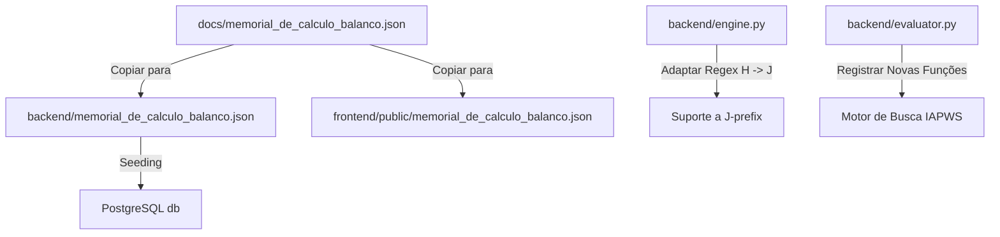

# 📑 Especificação: Novo Memorial de Cálculo e Motor de Busca de Vapor (IAPWS-IF97)

Esta especificação define o plano técnico para carregar o novo memorial de cálculo (`docs/memorial_de_calculo_balanco.json`), que altera o prefixo de variáveis de `H` para `J`, reorganiza os setores/subgrupos do sistema, e introduz equações físicas reais para cálculo de propriedades de vapor saturado e superaquecido (entalpia, entropia, temperatura e pressão) com base na biblioteca `iapws`.

---

## 1. Escopo Técnico & Regras de Negócio

### 1.1 Sincronização e Carga do Novo Memorial
1. **Sincronização de Arquivos**:
   - O arquivo `docs/memorial_de_calculo_balanco.json` (ajustado pelo usuário) deve ser copiado para:
     - `backend/memorial_de_calculo_balanco.json` (semeadura do backend)
     - `frontend/public/memorial_de_calculo_balanco.json` (semeadura e uso no frontend)
2. **Purgar Dados Antigos (H-prefix)**:
   - Como a estrutura do memorial de cálculo mudou completamente o prefixo de ID das variáveis de `H` para `J`, a tabela de banco de dados deve ser limpa (`TRUNCATE` ou deleção em cascata) antes da semeadura para evitar mistura de variáveis obsoletas de prefixo `H` com as novas variáveis `J`.
3. **Adaptação do Motor AST (Prefix-Agnostic)**:
   - O motor em `backend/engine.py` possui lógicas hardcoded vinculadas ao prefixo `H` (por exemplo, `expand_ranges` e expressões regulares). Deve ser atualizado para suportar o prefixo `J` de forma dinâmica ou suportar ambos os prefixos.
   - O cálculo especial de densidade do vinho (`H273` baseado em `H272`) deve ser migrado para o novo ID (`J270` baseado em `J269` ou similar) mapeando o sufixo numérico de forma prefixo-agnóstica.

### 1.2 Motor de Busca Termodinâmico (`evaluator.py`)
1. **Novas Funções de Vapor**:
   - Para suportar cálculos de vapor em turbinas e trocadores de calor sem depender de tabelas estáticas `PROCV` de tamanho limitado, serão expostas novas funções no motor de fórmulas AST:
     - `VAPOR_H(P; T)`: Entalpia (kJ/kg) do vapor superaquecido ou subresfriado dada a pressão (bar) e temperatura (°C).
     - `VAPOR_S(P; T)`: Entropia (kJ/kg/K) dada a pressão (bar) e temperatura (°C).
     - `VAPOR_H_SAT(P)`: Entalpia de vapor saturado (x=1) dada a pressão (bar).
     - `VAPOR_H_LIQ(P)`: Entalpia de líquido saturado (x=0) dada a pressão (bar).
     - `VAPOR_H_PS(P; s)`: Entalpia teórica isentrópica dada a pressão (bar) e entropia target `s` (kJ/kg/K) para o estágio de saída das turbinas.
     - `VAPOR_T_SAT(P)`: Temperatura de saturação (°C) dada a pressão (bar).
     - `VAPOR_LATENT(P)`: Calor latente de vaporização (kJ/kg) a uma dada pressão (bar), calculado como `VAPOR_H_SAT(P) - VAPOR_H_LIQ(P)`.
2. **Conversão de Unidades**:
   - A biblioteca `iapws` exige pressão absoluta em MPa e temperatura em Kelvin.
   - A pressão do memorial de cálculo é fornecida em **bar** (geralmente manométrica/gauge).
   - Conversão padrão: `P_abs_MPa = (P_gauge + patm) * 0.1` (onde `patm` é a constante de pressão atmosférica, discutida nos Socratic Questions).
   - Temperatura: `T_kelvin = T_celsius + 273.15`.

---

## 2. Planejamento das Mudanças

---

## 3. Plano de Verificação

### Testes Automatizados
- Teste de integração em `backend/test_engine.py` cobrindo todas as novas funções (`VAPOR_H`, `VAPOR_S`, `VAPOR_H_PS`, etc.) contra valores físicos conhecidos de tabelas de vapor.
- Validação de que a ordenação topológica e o cálculo convergem sem ciclos infinitos usando o novo memorial de cálculo completo.

### Verificação Manual
- Validar via frontend se a árvore lateral exibe o novo setor `INFORMAÇÕES TURBINAS` e seus respectivos 4 subgrupos.
- Modificar o valor de pressão ou temperatura de entrada da turbina no frontend e certificar-se de que a entalpia e a entropia teóricas/reais mudam adequadamente sem quebras de execução.
