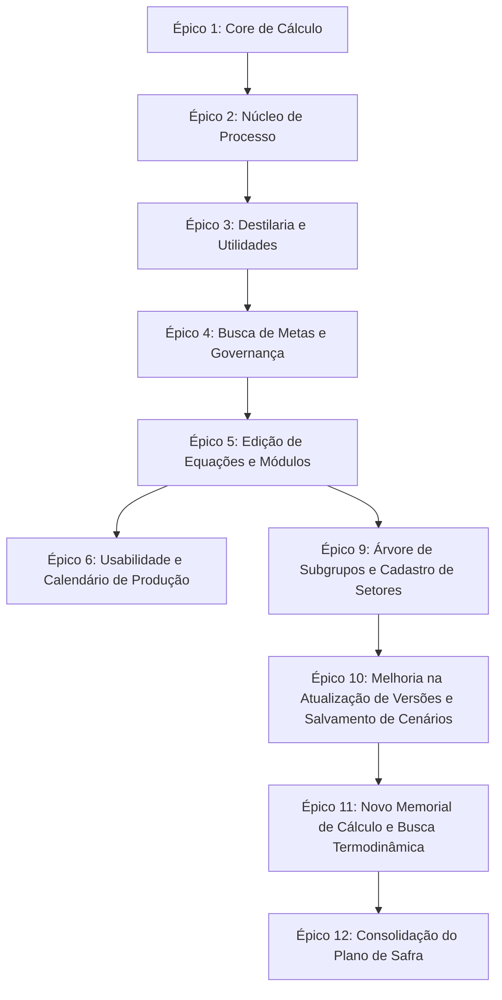

# 📑 Grafo de Tarefas e Histórico de Entregas (Task Master)

Este documento registra o grafo sequencial de tarefas planejadas e concluídas em todo o ciclo de desenvolvimento do sistema de Balanço de Massa e Energia.

---

## 🗺️ Mapa de Dependência dos Épicos

---

## 📋 Lista Sequencial de Tarefas

### Épico 1: Core de Cálculo (Base)
* [x] **Tarefa 1.1**: Modelagem do interpretador de fórmulas AST e operador matemático em Python.
* [x] **Tarefa 1.2**: Implementação do resolvedor topológico de ciclos e iterações de convergência.
* [x] **Tarefa 1.3**: Testes de validação matemática simples.

### Épico 2: Núcleo de Processo (Termodinâmica)
* [x] **Tarefa 2.1**: Integração com a biblioteca de cálculo físico `iapws` (IAPWS-IF97).
* [x] **Tarefa 2.2**: Implementação da função `PROCV` com busca na tabela termodinâmica de Vapor.
* [x] **Tarefa 2.3**: Sidebar retrátil para navegação responsiva por setores de processo.

### Épico 3: Destilaria e Utilidades (Matemática Estendida & Design)
* [x] **Tarefa 3.1**: Implementação das funções `LN`, `SUBTOTAL` (soma) e `SOMASES` condicional.
* [x] **Tarefa 3.2**: Polinômio de OIML para densidade do vinho (`H273`) baseado no teor alcoólico INPM.
* [x] **Tarefa 3.3**: Transição visual para paleta Teal/Cyan/Emerald (Maestro UI) e conformidade de contraste.
* [x] **Tarefa 3.4**: Auditoria de acessibilidade WCAG (aria-labels, label wrapping, skip-links, navegação por teclado).

### Épico 4: Busca de Metas & Governança (Inteligência & Banco)
* [x] **Tarefa 4.1**: Banco PostgreSQL em Docker Compose e persistência com SQLModel.
* [x] **Tarefa 4.2**: Solver numérico scipy (`root_scalar`) em `goalseek.py` (Brentq/Secant/Nelder-Mead).
* [x] **Tarefa 4.3**: Versionamento automático e trava de edição no frontend baseado no status (Aprovado/Final).
* [x] **Tarefa 4.4**: Geração de relatórios PDF com ReportLab e Excel (.xlsx) com openpyxl.
* [x] **Tarefa 4.5**: Validação e homologação completa com checklist do Antigravity Kit.

### Épico 5: Edição de Equações e Visualização em Módulos (Melhorias de Processo)
* [x] **Tarefa 5.1**: Alteração no resolvedor do backend (`backend/engine.py`) para aceitar IDs alfanuméricos arbitrários em fórmulas via análise da AST.
* [x] **Tarefa 5.2**: Criação do modal `VariableModal.tsx` no frontend para cadastro e edição de propriedades e equações de variáveis.
* [x] **Tarefa 5.3**: Criação do componente `SectorModules.tsx` para exibição das variáveis agrupadas por Definição em painéis/módulos visuais.
* [x] **Tarefa 5.4**: Integração dos componentes no `App.tsx` e refatoração geral do componente principal para respeitar o limite de 300 linhas físicas.
* [x] **Tarefa 5.5**: Homologação com testes automatizados e checklist de acessibilidade WCAG/design Maestro UI.

---

### Épico 6: Usabilidade e Calendário de Produção (BACKLOG)

> Status: **PENDENTE** — Aguardando retomada na próxima sessão.

* [x] **Tarefa 6.1** *(Busca de Variável)* — Implementar barra de pesquisa global para localizar variáveis por ID, Descrição ou Definição em tempo real. Indispensável para navegar rapidamente no universo de +1000 variáveis ao montar ou revisar equações.
* [ ] **Tarefa 6.2** *(Método Padronizado de Equações)* — Criar painel ou guia embutido na interface com as regras e sintaxe padrão aceitas pelo motor AST (ex: operadores válidos, funções suportadas `SE`, `SOMA`, `PROCV`, `LN`, nomes de variáveis permitidos). Reduzir erros de digitação de fórmulas.
* [ ] **Tarefa 6.3** *(Cadastro de Meses e Anos de Referência)* — Migrar o seletor estático de Ano Safra/Mês Referência para um cadastro dinâmico persistido no banco PostgreSQL, com suporte a calendário real de safra (meses de operação configuráveis por unidade). Base para o acompanhamento histórico e projeções futuras por período.

---

### Épico 9: Árvore de Subgrupos e Cadastro de Setores (ATUAL)

* [x] **Tarefa 9.1** *(Nova Tabela de Setores e Migração)* — Criar classe SQLModel `Sector`, alterar `Variable` para referenciar `Sector.id` via chave estrangeira, e criar rotina de migração automática no startup para semear os setores atuais a partir das variáveis de entrada.
* [x] **Tarefa 9.2** *(Roteamento CRUD de Setores)* — Implementar rotas CRUD no backend em `main.py` e `services.py` (`GET`, `POST`, `PATCH`, `DELETE`) para gerenciar setores, adicionando validação de ID único e bloqueio de exclusão para setores com variáveis órfãs.
* [x] **Tarefa 9.3** *(Navegação Hierárquica em Árvore)* — Refatorar o componente `Sidebar.tsx` no frontend para exibir uma árvore expandível de Setor -> Subgrupo (Definição), e integrar no clique do subgrupo a rolagem suave na tela central.
* [x] **Tarefa 9.4** *(Painel de Configurações de Setor)* — Adicionar aba de Configurações no painel lateral direito, contendo a interface de cadastro, edição e exclusão de setores e validações associadas.
* [x] **Tarefa 9.5** *(Homologação e Checklist)* — Validar o fluxo com testes automatizados e rodar o checklist do Antigravity Kit.
* [x] **Tarefa 9.6** *(Semeadura de Banco e Integração com Frontend)* — Ajustar a semeadura para atribuir ordem inicial a setores padrão.
* [x] **Tarefa 9.7** *(Ordenação Única e Personalizada de Setores)* — Implementar campo de ordenação numérico, ordenação padrão na API e UI, e regras de validação de unicidade.
* [x] **Tarefa 9.8** *(Auto-cadastro de Setores)* — Registrar no banco de dados automaticamente os novos setores criados via edição/cadastro de variáveis e recarregar a listagem do frontend.

---

### Épico 10: Melhoria na Atualização de Versões e Salvamento de Cenários (ATUAL)

* [x] **Tarefa 10.1** *(Salvamento de Cenário Ativo)* — Implementar método e rota PUT no backend para salvar as edições diretamente no cenário ativo caso seu status seja "Em Edição".
* [x] **Tarefa 10.2** *(Botão Salvar Alterações)* — Adicionar botão no painel de gerenciador de cenários do frontend para salvar as alterações do cenário ativo com indicador visual de pendência.
* [x] **Tarefa 10.3** *(Alerta de Saída)* — Registrar evento beforeunload no frontend para exibir alerta de confirmação ao tentar fechar/atualizar a aba caso existam modificações pendentes.
* [x] **Tarefa 10.4** *(Auditoria e Homologação)* — Executar suite de qualidade local e docker tests.

---

### Épico 11: Novo Memorial de Cálculo e Busca Termodinâmica (ATUAL)

* [x] **Tarefa 11.1** *(Sincronização)* — Sincronizar o arquivo `docs/memorial_de_calculo_balanco.json` com `backend/` e `frontend/public/`.
* [x] **Tarefa 11.2** *(Purga e Reset)* — Limpar registros antigos de prefixo `H` do banco de dados no startup para permitir a carga correta das novas variáveis com prefixo `J`.
* [x] **Tarefa 11.3** *(Suporte a J-prefix e Densidade)* — Adaptar o interpretador `engine.py` para suportar o prefixo `J` nas expressões de range/regex e calcular dinamicamente a densidade do vinho para `J270` baseado em `J269`.
* [x] **Tarefa 11.4** *(Funções Termodinâmicas)* — Implementar as novas funções termodinâmicas (`VAPOR_H`, `VAPOR_S`, etc.) com `iapws` no interpretador AST `evaluator.py` utilizando pressões absolutas.
* [x] **Tarefa 11.5** *(Mapeamento de Turbinas)* — Substituir valores fixos de turbinas por fórmulas de vapor no arquivo do memorial de cálculo e sincronizar.
* [x] **Tarefa 11.6** *(Tooltips no Frontend)* — Adicionar orientações e tooltips explicativos sobre as novas funções de vapor no painel lateral esquerdo/guia do frontend.
* [x] **Tarefa 11.7** *(Auditoria e Validação)* — Rodar suite de testes automatizados e validar convergência de cálculo local.
* [x] **Tarefa 11.8** *(Limpeza e Refatoração de Árvore)* — Limpar a extração de dados do Excel sem históricos antigos, reestruturar a árvore visual em 4 níveis (Setor -> Etapa -> Ponto de Controle -> Variável), remover o campo obsoleto `DEFINIÇÃO` de toda a arquitetura, e refatorar `VariableModal.tsx` separando `EquationDropdown.tsx` (respeitando o limite constitucional de 300 linhas).

---

### Épico 12: Consolidação do Plano de Safra (CONCLUÍDO)

* [x] **Tarefa 12.1** *(Esquema de Banco e Migração)* — Adicionar campos `in_harvest_plan`, `harvest_plan_op` e `harvest_plan_weight_var_id` à tabela `variables` e criar a nova tabela `harvest_plan_settings` no PostgreSQL/SQLite com migração automática no startup.
* [x] **Tarefa 12.2** *(Roteamento e Serviços Backend)* — Implementar endpoints de listagem de safras, recuperação/atualização de configurações de início de ciclo, recuperação/atualização em lote de configurações de variáveis e motor de consolidação anual com ordenação de meses e agregação topológica/ponderada.
* [x] **Tarefa 12.3** *(Interface do Plano de Safra)* — Criar aba dedicada "Plano de Safra" no frontend contendo painéis para visualização multi-anual dos cenários aprovados e configuração de variáveis (com autocompletar inteligente para seleção de pesos).
* [x] **Tarefa 12.4** *(Testes e Homologação)* — Implementar testes unitários e de integração abrangentes em `backend/test_harvest_plan.py` validando os operadores de agregação (`SUM`, `AVERAGE`, `WEIGHTED_AVERAGE`, `CALCULATE`) e o fluxo de alteração de mês inicial.

---

## 🛠️ Infraestrutura & DevOps

* [x] **Tarefa 7.1** *(Criação do .gitignore)* — Criar o arquivo `.gitignore` na raiz do projeto com as regras para ignorar a pasta `.agent/`, bancos locais SQLite (`*.db`), backups SQL (`*.sql`), ambientes virtuais Python (`.venv`, `__pycache__`), diretórios do Node.js (`node_modules`, `dist`, `build`) e arquivos sensíveis (`.env*`).

