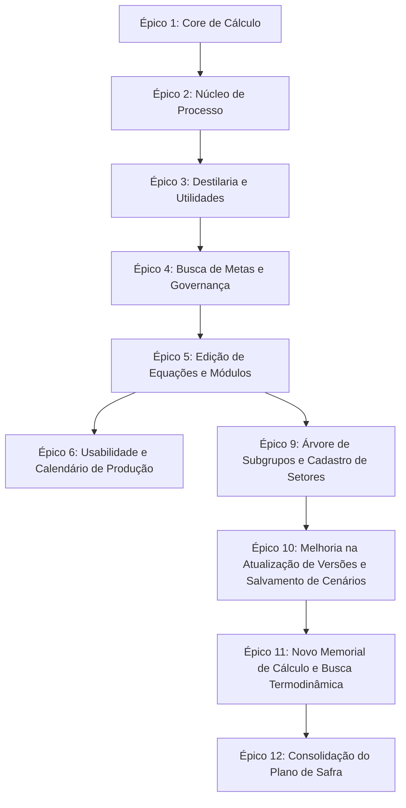

# 📑 Grafo de Tarefas e Histórico de Entregas (Task Master)

Este documento registra o grafo sequencial de tarefas planejadas e concluídas em todo o ciclo de desenvolvimento do sistema de Balanço de Massa e Energia.

---

## 🗺️ Mapa de Dependência dos Épicos

---

## 📋 Lista Sequencial de Tarefas

### Épico 1: Core de Cálculo (Base)
* [x] **Tarefa 1.1**: Modelagem do interpretador de fórmulas AST e operador matemático em Python.
* [x] **Tarefa 1.2**: Implementação do resolvedor topológico de ciclos e iterações de convergência.
* [x] **Tarefa 1.3**: Testes de validação matemática simples.

### Épico 2: Núcleo de Processo (Termodinâmica)
* [x] **Tarefa 2.1**: Integração com a biblioteca de cálculo físico `iapws` (IAPWS-IF97).
* [x] **Tarefa 2.2**: Implementação da função `PROCV` com busca na tabela termodinâmica de Vapor.
* [x] **Tarefa 2.3**: Sidebar retrátil para navegação responsiva por setores de processo.

### Épico 3: Destilaria e Utilidades (Matemática Estendida & Design)
* [x] **Tarefa 3.1**: Implementação das funções `LN`, `SUBTOTAL` (soma) e `SOMASES` condicional.
* [x] **Tarefa 3.2**: Polinômio de OIML para densidade do vinho (`H273`) baseado no teor alcoólico INPM.
* [x] **Tarefa 3.3**: Transição visual para paleta Teal/Cyan/Emerald (Maestro UI) e conformidade de contraste.
* [x] **Tarefa 3.4**: Auditoria de acessibilidade WCAG (aria-labels, label wrapping, skip-links, navegação por teclado).

### Épico 4: Busca de Metas & Governança (Inteligência & Banco)
* [x] **Tarefa 4.1**: Banco PostgreSQL em Docker Compose e persistência com SQLModel.
* [x] **Tarefa 4.2**: Solver numérico scipy (`root_scalar`) em `goalseek.py` (Brentq/Secant/Nelder-Mead).
* [x] **Tarefa 4.3**: Versionamento automático e trava de edição no frontend baseado no status (Aprovado/Final).
* [x] **Tarefa 4.4**: Geração de relatórios PDF com ReportLab e Excel (.xlsx) com openpyxl.
* [x] **Tarefa 4.5**: Validação e homologação completa com checklist do Antigravity Kit.

### Épico 5: Edição de Equações e Visualização em Módulos (Melhorias de Processo)
* [x] **Tarefa 5.1**: Alteração no resolvedor do backend (`backend/engine.py`) para aceitar IDs alfanuméricos arbitrários em fórmulas via análise da AST.
* [x] **Tarefa 5.2**: Criação do modal `VariableModal.tsx` no frontend para cadastro e edição de propriedades e equações de variáveis.
* [x] **Tarefa 5.3**: Criação do componente `SectorModules.tsx` para exibição das variáveis agrupadas por Definição em painéis/módulos visuais.
* [x] **Tarefa 5.4**: Integração dos componentes no `App.tsx` e refatoração geral do componente principal para respeitar o limite de 300 linhas físicas.
* [x] **Tarefa 5.5**: Homologação com testes automatizados e checklist de acessibilidade WCAG/design Maestro UI.

---

### Épico 6: Usabilidade e Calendário de Produção (BACKLOG)

> Status: **PENDENTE** — Aguardando retomada na próxima sessão.

* [x] **Tarefa 6.1** *(Busca de Variável)* — Implementar barra de pesquisa global para localizar variáveis por ID, Descrição ou Definição em tempo real. Indispensável para navegar rapidamente no universo de +1000 variáveis ao montar ou revisar equações.
* [x] **Tarefa 6.2** *(Editor Inteligente, Auditoria e Melhorias Visuais)* — Implementar realce e validação de sintaxe no editor, botão de auditoria para rastrear dependências e melhorias visuais como tooltips e alinhamento numérico.
* [x] **Tarefa 6.3** *(Cadastro de Meses e Anos de Referência)* — Migrar o seletor estático de Ano Safra/Mês Referência para um cadastro dinâmico persistido no banco PostgreSQL, com suporte a calendário real de safra (meses de operação configuráveis por unidade). Base para o acompanhamento histórico e projeções futuras por período.
* [x] **Tarefa 6.4** *(Tolerância de Reciclo e Filtros de Tipo)* — Adicionar configuração dinâmica de tolerância do solucionador, exibição contínua do resíduo e botões rápidos para filtragem por tipo de variável.

---

### Épico 9: Árvore de Subgrupos e Cadastro de Setores (ATUAL)

* [x] **Tarefa 9.1** *(Nova Tabela de Setores e Migração)* — Criar classe SQLModel `Sector`, alterar `Variable` para referenciar `Sector.id` via chave estrangeira, e criar rotina de migração automática no startup para semear os setores atuais a partir das variáveis de entrada.
* [x] **Tarefa 9.2** *(Roteamento CRUD de Setores)* — Implementar rotas CRUD no backend em `main.py` e `services.py` (`GET`, `POST`, `PATCH`, `DELETE`) para gerenciar setores, adicionando validação de ID único e bloqueio de exclusão para setores com variáveis órfãs.
* [x] **Tarefa 9.3** *(Navegação Hierárquica em Árvore)* — Refatorar o componente `Sidebar.tsx` no frontend para exibir uma árvore expandível de Setor -> Subgrupo (Definição), e integrar no clique do subgrupo a rolagem suave na tela central.
* [x] **Tarefa 9.4** *(Painel de Configurações de Setor)* — Adicionar aba de Configurações no painel lateral direito, contendo a interface de cadastro, edição e exclusão de setores e validações associadas.
* [x] **Tarefa 9.5** *(Homologação e Checklist)* — Validar o fluxo com testes automatizados e rodar o checklist do Antigravity Kit.
* [x] **Tarefa 9.6** *(Semeadura de Banco e Integração com Frontend)* — Ajustar a semeadura para atribuir ordem inicial a setores padrão.
* [x] **Tarefa 9.7** *(Ordenação Única e Personalizada de Setores)* — Implementar campo de ordenação numérico, ordenação padrão na API e UI, e regras de validação de unicidade.
* [x] **Tarefa 9.8** *(Auto-cadastro de Setores)* — Registrar no banco de dados automaticamente os novos setores criados via edição/cadastro de variáveis e recarregar a listagem do frontend.

---

### Épico 10: Melhoria na Atualização de Versões e Salvamento de Cenários (ATUAL)

* [x] **Tarefa 10.1** *(Salvamento de Cenário Ativo)* — Implementar método e rota PUT no backend para salvar as edições diretamente no cenário ativo caso seu status seja "Em Edição".
* [x] **Tarefa 10.2** *(Botão Salvar Alterações)* — Adicionar botão no painel de gerenciador de cenários do frontend para salvar as alterações do cenário ativo com indicador visual de pendência.
* [x] **Tarefa 10.3** *(Alerta de Saída)* — Registrar evento beforeunload no frontend para exibir alerta de confirmação ao tentar fechar/atualizar a aba caso existam modificações pendentes.
* [x] **Tarefa 10.4** *(Auditoria e Homologação)* — Executar suite de qualidade local e docker tests.
* [x] **Tarefa 10.5** *(Tratamento Fail-Fast de Conexão)* — Implementar banner de aviso offline, travamento de interface no frontend e desabilitar fallbacks silenciosos.

---

### Épico 11: Novo Memorial de Cálculo e Busca Termodinâmica (ATUAL)

* [x] **Tarefa 11.1** *(Sincronização)* — Sincronizar o arquivo `docs/memorial_de_calculo_balanco.json` com `backend/` e `frontend/public/`.
* [x] **Tarefa 11.2** *(Purga e Reset)* — Limpar registros antigos de prefixo `H` do banco de dados no startup para permitir a carga correta das novas variáveis com prefixo `J`.
* [x] **Tarefa 11.3** *(Suporte a J-prefix e Densidade)* — Adaptar o interpretador `engine.py` para suportar o prefixo `J` nas expressões de range/regex e calcular dinamicamente a densidade do vinho para `J270` baseado em `J269`.
* [x] **Tarefa 11.4** *(Funções Termodinâmicas)* — Implementar as novas funções termodinâmicas (`VAPOR_H`, `VAPOR_S`, etc.) com `iapws` no interpretador AST `evaluator.py` utilizando pressões absolutas.
* [x] **Tarefa 11.5** *(Mapeamento de Turbinas)* — Substituir valores fixos de turbinas por fórmulas de vapor no arquivo do memorial de cálculo e sincronizar.
* [x] **Tarefa 11.6** *(Tooltips no Frontend)* — Adicionar orientações e tooltips explicativos sobre as novas funções de vapor no painel lateral esquerdo/guia do frontend.
* [x] **Tarefa 11.7** *(Auditoria e Validação)* — Rodar suite de testes automatizados e validar convergência de cálculo local.
* [x] **Tarefa 11.8** *(Limpeza e Refatoração de Árvore)* — Limpar a extração de dados do Excel sem históricos antigos, reestruturar a árvore visual em 4 níveis (Setor -> Etapa -> Ponto de Controle -> Variável), remover o campo obsoleto `DEFINIÇÃO` de toda a arquitetura, e refatorar `VariableModal.tsx` separando `EquationDropdown.tsx` (respeitando o limite constitucional de 300 linhas).

---

### Épico 12: Consolidação do Plano de Safra (CONCLUÍDO)

* [x] **Tarefa 12.1** *(Esquema de Banco e Migração)* — Adicionar campos `in_harvest_plan`, `harvest_plan_op` e `harvest_plan_weight_var_id` à tabela `variables` e criar a nova tabela `harvest_plan_settings` no PostgreSQL/SQLite com migração automática no startup.
* [x] **Tarefa 12.2** *(Roteamento e Serviços Backend)* — Implementar endpoints de listagem de safras, recuperação/atualização de configurações de início de ciclo, recuperação/atualização em lote de configurações de variáveis e motor de consolidação anual com ordenação de meses e agregação topológica/ponderada.
* [x] **Tarefa 12.3** *(Interface do Plano de Safra)* — Criar aba dedicada "Plano de Safra" no frontend contendo painéis para visualização multi-anual dos cenários aprovados e configuração de variáveis (com autocompletar inteligente para seleção de pesos).
* [x] **Tarefa 12.4** *(Testes e Homologação)* — Implementar testes unitários e de integração abrangentes em `backend/test_harvest_plan.py` validando os operadores de agregação (`SUM`, `AVERAGE`, `WEIGHTED_AVERAGE`, `CALCULATE`) e o fluxo de alteração de mês inicial.

### Épico 14: Substituição Inteligente de Variáveis (CONCLUÍDO)

* [x] **Tarefa 14.1** *(Motor de Substituição Baseado em Regex e Parênteses de Precedência)* — Implementar rotina de substituição de variáveis com regex resiliente que preserva a formatação Excel (vírgula decimal e ponto-e-vírgula).
* [x] **Tarefa 14.2** *(Endpoints de API)* — Criar `/replace-preview` e `/replace-confirm` com suporte a `replacement_expr` customizado e detecção de variáveis órfãs.
* [x] **Tarefa 14.3** *(Interface e UX do Modal)* — Desenvolver `<SubstitutionModal />` com árvore de dependências e overlay de checklist animado de 4 etapas para processamentos demorados.
* [x] **Tarefa 14.4** *(Otimização de Performance)* — Implementar cache em memória e resolução antecipada de dependências para modelos de grande escala (+1000 variáveis).
* [x] **Tarefa 14.5** *(Qualidade e Validação)* — Suite de testes pytest completa de substituição com 100% de cobertura nos cenários críticos.

### Épico 15: Segregação de Variáveis Inativas (CONCLUÍDO)

* [x] **Tarefa 15.1** *(Terminologia de Inativa)* — Renomear o status de `DESCONTINUADA` para `INATIVA` em todas as camadas (banco de dados, serviços backend, testes e frontend).
* [x] **Tarefa 15.2** *(Filtro no Backend)* — Filtrar variáveis inativas nas APIs de listagem geral e de configuração do plano de safra, mas mantendo o retorno no carregamento de cenários com o campo `"STATUS"`.
* [x] **Tarefa 15.3** *(Exibição e Controle)* — Criar toggle "Mostrar Inativas" no frontend, filtrar variáveis inativas no setor e renderizar inativas visíveis com estilo desbotado/itálico e inputs desabilitados.
* [x] **Tarefa 15.4** *(Ajustes no Plano de Safra)* — Resetar automaticamente a participação no Plano de Safra (`in_harvest_plan = False` e configurações associadas) no momento em que a variável é inativada (arquivada).

---

### Épico 16: Persistência e Filtragem Reativa de Status do Dashboard (CONCLUÍDO)

* [x] **Tarefa 16.1** *(Elevação do Estado)* — Elevar o estado do filtro de status do dashboard (`activeStatusFilter`, `setActiveStatusFilter`) para o `App.tsx` e integrá-lo com `StatusDashboard.tsx`.
* [x] **Tarefa 16.2** *(Barra de Filtro local)* — Implementar a barra visual de filtro de status (Todos, Convergido, Com Erro, Pendente) no componente `SectorModules.tsx`.
* [x] **Tarefa 16.3** *(Lógica de Filtragem de Variáveis)* — Implementar a lógica de filtragem por status na listagem de variáveis de `SectorModules.tsx` baseada na classificação de calculado convergido/erros e inputs sem valor.
* [x] **Tarefa 16.4** *(Qualidade e Validação)* — Executar verificação com `checklist.py`, testar o fluxo de filtragem e validar as diretrizes de código limpo.

---

### Épico 17: Padronização de Exibição e Percentuais (CONCLUÍDO)

* [x] **Tarefa 17.1** *(Modelos e Migração do Banco de Dados)* — Adicionar as colunas `casas_decimais` (int, nullable), `tipo_exibicao` (string, default "NUMBER") e `percent_base` (string, default "DECIMAL") à classe SQLModel `Variable` em `backend/database.py`, e atualizar a rotina de migração em `backend/migrations.py` para criar estas colunas no banco de dados existente com valores padrão coerentes.
* [x] **Tarefa 17.2** *(Schemas e Endpoints de API)* — Atualizar as classes Pydantic em `backend/schemas.py` para incluir os novos campos (`casas_decimais`, `tipo_exibicao`, `percent_base`). Modificar as rotinas de criação/atualização em `backend/services_variables.py` e endpoints em `backend/main.py` para ler e persistir estas novas configurações de variável.
* [x] **Tarefa 17.3** *(Exportações formatadas)* — Modificar a lógica de formatação de valores em `backend/exports.py` (relatórios PDF e planilhas Excel) para que utilizem a propriedade `casas_decimais` (ou fallback de 2 casas) e apliquem a notação `%` caso o `tipo_exibicao` seja `PERCENTAGE`.
* [x] **Tarefa 17.4** *(Frontend: Cadastro de Variáveis)* — Atualizar o componente `VariableModal.tsx` no frontend para permitir configurar os novos campos: casas decimais (input numérico 0-6), tipo de exibição (Número vs Percentual) e base de cálculo (Decimal vs Inteiro - exibido apenas se tipo for Percentual).
* [x] **Tarefa 17.5** *(Frontend: Exibição e Edição nos Módulos)* — Ajustar a exibição e edição de inputs de variáveis no frontend (`SectorModules.tsx` e `App.tsx`). Se uma variável for percentual com base decimal, converter o valor do input (ex: `value * 100`) para exibição e edição, salvando de volta como `value / 100`. Mostrar o símbolo `%` e aplicar o arredondamento `.toFixed(casas_decimais)` na visualização.
* [x] **Tarefa 17.6** *(Testes e Homologação)* — Criar suíte de testes unitários para validar a migração de esquema, criação/edição de variáveis com metadados de formatação, e testes de integração de cálculo/resolução de variáveis com diferentes formatações. Rodar o script `checklist.py`.

---

## 🛠️ Infraestrutura & DevOps

* [x] **Tarefa 7.1** *(Criação do .gitignore)* — Criar o arquivo `.gitignore` na raiz do projeto com as regras para ignorar a pasta `.agent/`, bancos locais SQLite (`*.db`), backups SQL (`*.sql`), ambientes virtuais Python (`.venv`, `__pycache__`), diretórios do Node.js (`node_modules`, `dist`, `build`) e arquivos sensíveis (`.env*`).

---

### Épico 18: Ordenação em Cascata de Variáveis (CONCLUÍDO)

* [x] **Tarefa 18.1** *(Modelagem e Migração)* — Criar tabelas `Stage` e `ControlPoint` no backend, adicionar `control_point_id` e `ordem` em `Variable`, e implementar a migração em `migrations.py` com baseline alfabético inicial (+10).
* [x] **Tarefa 18.2** *(Schemas e Services)* — Adaptar schemas Pydantic em `schemas.py` e rotinas CRUD/leitura em `services_variables.py` para converter os relacionamentos em campos legados de etapa/ponto de controle.
* [x] **Tarefa 18.3** *(Endpoints PATCH)* — Implementar rotas PATCH no backend para atualização em lote da ordenação de Etapas, Pontos de Controle e Variáveis.
* [x] **Tarefa 18.4** *(Utilitário de Ordenação Frontend)* — Criar utilitário `frontend/src/utils/sorting.ts` para estruturar o agrupamento e ordenação da cascata mantendo o limite constitucional de 300 linhas em componentes.
* [x] **Tarefa 18.5** *(Interface de Reordenação Drag-and-Drop & Acessibilidade)* — Implementar drag-and-drop HTML5 nativo no frontend e botões de subir/descer (WCAG) nos três níveis (Etapa, Ponto de Controle e Variável).
* [x] **Tarefa 18.6** *(Testes e Validação)* — Adicionar suíte de testes unitários para reordenação no backend, atualizar exports de PDF/Excel e executar suite de verificação local com `checklist.py`.

---

### Épico 19: Unificação de Configurações e Sincronização de Ciclo (CONCLUÍDO)

* [x] **Tarefa 19.1** *(Modelagem e Migração)* — Adicionar coluna `cycle_start_month` à tabela `Scenario` no `database.py` e ajustar a inicialização em `seeding.py`, `migrations_legacy.py` e rotinas de migração em `migrations.py`.
* [x] **Tarefa 19.2** *(Roteamento Centralizado)* — Migrar os endpoints de configuração para a rota central `/api/settings` em `router_settings.py` e excluir os endpoints obsoletos em `main.py`. Implementar `PATCH /settings/months/reorder` com validação de array completo, transação atômica e idempotência.
* [x] **Tarefa 19.3** *(Integração Frontend e Warnings)* — Atualizar o frontend para as novas URLs, enviar o array completo de meses no swap e mostrar aviso visual de ciclo desatualizado com botão de recálculo manual.
* [x] **Tarefa 19.4** *(Testes Unitários)* — Corrigir e criar testes unitários no backend validando as rotas de configurações unificadas, ordenação transacional e persistência do ciclo.

---

### Épico 20: Correção de Digitação de Percentuais (CONCLUÍDO)

* [x] **Tarefa 20.1** *(Componente de Input de Variável)* — Desenvolver o componente `FormattedVariableInput.tsx` encapsulando estado de digitação intermediário para evitar a perda de decimais (ponto e vírgula).
* [x] **Tarefa 20.2** *(Integração nos Módulos e Premissas)* — Substituir a entrada direta em `SectorVariableRow.tsx` e `ScenarioPremises.tsx` pelo novo componente e formatar visualmente com `%` no painel de premissas.
* [x] **Tarefa 20.3** *(Validação)* — Executar suite de checagem com `checklist.py`, testar fluxos de digitação e verificar conformidade de limites de arquivos e aninhamento.

---

### Épico 21: Ordenação Personalizada e Divisores no Plano de Safra (CONCLUÍDO)

# 📑 Grafo de Tarefas e Histórico de Entregas (Task Master)

Este documento registra o grafo sequencial de tarefas planejadas e concluídas em todo o ciclo de desenvolvimento do sistema de Balanço de Massa e Energia.

---

## 🗺️ Mapa de Dependência dos Épicos

---

## 📋 Lista Sequencial de Tarefas

### Épico 1: Core de Cálculo (Base)
* [x] **Tarefa 1.1**: Modelagem do interpretador de fórmulas AST e operador matemático em Python.
* [x] **Tarefa 1.2**: Implementação do resolvedor topológico de ciclos e iterações de convergência.
* [x] **Tarefa 1.3**: Testes de validação matemática simples.

### Épico 2: Núcleo de Processo (Termodinâmica)
* [x] **Tarefa 2.1**: Integração com a biblioteca de cálculo físico `iapws` (IAPWS-IF97).
* [x] **Tarefa 2.2**: Implementação da função `PROCV` com busca na tabela termodinâmica de Vapor.
* [x] **Tarefa 2.3**: Sidebar retrátil para navegação responsiva por setores de processo.

### Épico 3: Destilaria e Utilidades (Matemática Estendida & Design)
* [x] **Tarefa 3.1**: Implementação das funções `LN`, `SUBTOTAL` (soma) e `SOMASES` condicional.
* [x] **Tarefa 3.2**: Polinômio de OIML para densidade do vinho (`H273`) baseado no teor alcoólico INPM.
* [x] **Tarefa 3.3**: Transição visual para paleta Teal/Cyan/Emerald (Maestro UI) e conformidade de contraste.
* [x] **Tarefa 3.4**: Auditoria de acessibilidade WCAG (aria-labels, label wrapping, skip-links, navegação por teclado).

### Épico 4: Busca de Metas & Governança (Inteligência & Banco)
* [x] **Tarefa 4.1**: Banco PostgreSQL em Docker Compose e persistência com SQLModel.
* [x] **Tarefa 4.2**: Solver numérico scipy (`root_scalar`) em `goalseek.py` (Brentq/Secant/Nelder-Mead).
* [x] **Tarefa 4.3**: Versionamento automático e trava de edição no frontend baseado no status (Aprovado/Final).
* [x] **Tarefa 4.4**: Geração de relatórios PDF com ReportLab e Excel (.xlsx) com openpyxl.
* [x] **Tarefa 4.5**: Validação e homologação completa com checklist do Antigravity Kit.

### Épico 5: Edição de Equações e Visualização em Módulos (Melhorias de Processo)
* [x] **Tarefa 5.1**: Alteração no resolvedor do backend (`backend/engine.py`) para aceitar IDs alfanuméricos arbitrários em fórmulas via análise da AST.
* [x] **Tarefa 5.2**: Criação do modal `VariableModal.tsx` no frontend para cadastro e edição de propriedades e equações de variáveis.
* [x] **Tarefa 5.3**: Criação do componente `SectorModules.tsx` para exibição das variáveis agrupadas por Definição em painéis/módulos visuais.
* [x] **Tarefa 5.4**: Integração dos componentes no `App.tsx` e refatoração geral do componente principal para respeitar o limite de 300 linhas físicas.
* [x] **Tarefa 5.5**: Homologação com testes automatizados e checklist de acessibilidade WCAG/design Maestro UI.

---

### Épico 6: Usabilidade e Calendário de Produção (BACKLOG)

> Status: **PENDENTE** — Aguardando retomada na próxima sessão.

* [x] **Tarefa 6.1** *(Busca de Variável)* — Implementar barra de pesquisa global para localizar variáveis por ID, Descrição ou Definição em tempo real. Indispensável para navegar rapidamente no universo de +1000 variáveis ao montar ou revisar equações.
* [x] **Tarefa 6.2** *(Editor Inteligente, Auditoria e Melhorias Visuais)* — Implementar realce e validação de sintaxe no editor, botão de auditoria para rastrear dependências e melhorias visuais como tooltips e alinhamento numérico.
* [x] **Tarefa 6.3** *(Cadastro de Meses e Anos de Referência)* — Migrar o seletor estático de Ano Safra/Mês Referência para um cadastro dinâmico persistido no banco PostgreSQL, com suporte a calendário real de safra (meses de operação configuráveis por unidade). Base para o acompanhamento histórico e projeções futuras por período.
* [x] **Tarefa 6.4** *(Tolerância de Reciclo e Filtros de Tipo)* — Adicionar configuração dinâmica de tolerância do solucionador, exibição contínua do resíduo e botões rápidos para filtragem por tipo de variável.

---

### Épico 9: Árvore de Subgrupos e Cadastro de Setores (ATUAL)

* [x] **Tarefa 9.1** *(Nova Tabela de Setores e Migração)* — Criar classe SQLModel `Sector`, alterar `Variable` para referenciar `Sector.id` via chave estrangeira, e criar rotina de migração automática no startup para semear os setores atuais a partir das variáveis de entrada.
* [x] **Tarefa 9.2** *(Roteamento CRUD de Setores)* — Implementar rotas CRUD no backend em `main.py` e `services.py` (`GET`, `POST`, `PATCH`, `DELETE`) para gerenciar setores, adicionando validação de ID único e bloqueio de exclusão para setores com variáveis órfãs.
* [x] **Tarefa 9.3** *(Navegação Hierárquica em Árvore)* — Refatorar o componente `Sidebar.tsx` no frontend para exibir uma árvore expandível de Setor -> Subgrupo (Definição), e integrar no clique do subgrupo a rolagem suave na tela central.
* [x] **Tarefa 9.4** *(Painel de Configurações de Setor)* — Adicionar aba de Configurações no painel lateral direito, contendo a interface de cadastro, edição e exclusão de setores e validações associadas.
* [x] **Tarefa 9.5** *(Homologação e Checklist)* — Validar o fluxo com testes automatizados e rodar o checklist do Antigravity Kit.
* [x] **Tarefa 9.6** *(Semeadura de Banco e Integração com Frontend)* — Ajustar a semeadura para atribuir ordem inicial a setores padrão.
* [x] **Tarefa 9.7** *(Ordenação Única e Personalizada de Setores)* — Implementar campo de ordenação numérico, ordenação padrão na API e UI, e regras de validação de unicidade.
* [x] **Tarefa 9.8** *(Auto-cadastro de Setores)* — Registrar no banco de dados automaticamente os novos setores criados via edição/cadastro de variáveis e recarregar a listagem do frontend.

---

### Épico 10: Melhoria na Atualização de Versões e Salvamento de Cenários (ATUAL)

* [x] **Tarefa 10.1** *(Salvamento de Cenário Ativo)* — Implementar método e rota PUT no backend para salvar as edições diretamente no cenário ativo caso seu status seja "Em Edição".
* [x] **Tarefa 10.2** *(Botão Salvar Alterações)* — Adicionar botão no painel de gerenciador de cenários do frontend para salvar as alterações do cenário ativo com indicador visual de pendência.
* [x] **Tarefa 10.3** *(Alerta de Saída)* — Registrar evento beforeunload no frontend para exibir alerta de confirmação ao tentar fechar/atualizar a aba caso existam modificações pendentes.
* [x] **Tarefa 10.4** *(Auditoria e Homologação)* — Executar suite de qualidade local e docker tests.
* [x] **Tarefa 10.5** *(Tratamento Fail-Fast de Conexão)* — Implementar banner de aviso offline, travamento de interface no frontend e desabilitar fallbacks silenciosos.

---

### Épico 11: Novo Memorial de Cálculo e Busca Termodinâmica (ATUAL)

* [x] **Tarefa 11.1** *(Sincronização)* — Sincronizar o arquivo `docs/memorial_de_calculo_balanco.json` com `backend/` e `frontend/public/`.
* [x] **Tarefa 11.2** *(Purga e Reset)* — Limpar registros antigos de prefixo `H` do banco de dados no startup para permitir a carga correta das novas variáveis com prefixo `J`.
* [x] **Tarefa 11.3** *(Suporte a J-prefix e Densidade)* — Adaptar o interpretador `engine.py` para suportar o prefixo `J` nas expressões de range/regex e calcular dinamicamente a densidade do vinho para `J270` baseado em `J269`.
* [x] **Tarefa 11.4** *(Funções Termodinâmicas)* — Implementar as novas funções termodinâmicas (`VAPOR_H`, `VAPOR_S`, etc.) com `iapws` no interpretador AST `evaluator.py` utilizando pressões absolutas.
* [x] **Tarefa 11.5** *(Mapeamento de Turbinas)* — Substituir valores fixos de turbinas por fórmulas de vapor no arquivo do memorial de cálculo e sincronizar.
* [x] **Tarefa 11.6** *(Tooltips no Frontend)* — Adicionar orientações e tooltips explicativos sobre as novas funções de vapor no painel lateral esquerdo/guia do frontend.
* [x] **Tarefa 11.7** *(Auditoria e Validação)* — Rodar suite de testes automatizados e validar convergência de cálculo local.
* [x] **Tarefa 11.8** *(Limpeza e Refatoração de Árvore)* — Limpar a extração de dados do Excel sem históricos antigos, reestruturar a árvore visual em 4 níveis (Setor -> Etapa -> Ponto de Controle -> Variável), remover o campo obsoleto `DEFINIÇÃO` de toda a arquitetura, e refatorar `VariableModal.tsx` separando `EquationDropdown.tsx` (respeitando o limite constitucional de 300 linhas).

---

### Épico 12: Consolidação do Plano de Safra (CONCLUÍDO)

* [x] **Tarefa 12.1** *(Esquema de Banco e Migração)* — Adicionar campos `in_harvest_plan`, `harvest_plan_op` e `harvest_plan_weight_var_id` à tabela `variables` e criar a nova tabela `harvest_plan_settings` no PostgreSQL/SQLite com migração automática no startup.
* [x] **Tarefa 12.2** *(Roteamento e Serviços Backend)* — Implementar endpoints de listagem de safras, recuperação/atualização de configurações de início de ciclo, recuperação/atualização em lote de configurações de variáveis e motor de consolidação anual com ordenação de meses e agregação topológica/ponderada.
* [x] **Tarefa 12.3** *(Interface do Plano de Safra)* — Criar aba dedicada "Plano de Safra" no frontend contendo painéis para visualização multi-anual dos cenários aprovados e configuração de variáveis (com autocompletar inteligente para seleção de pesos).
* [x] **Tarefa 12.4** *(Testes e Homologação)* — Implementar testes unitários e de integração abrangentes em `backend/test_harvest_plan.py` validando os operadores de agregação (`SUM`, `AVERAGE`, `WEIGHTED_AVERAGE`, `CALCULATE`) e o fluxo de alteração de mês inicial.

### Épico 14: Substituição Inteligente de Variáveis (CONCLUÍDO)

* [x] **Tarefa 14.1** *(Motor de Substituição Baseado em Regex e Parênteses de Precedência)* — Implementar rotina de substituição de variáveis com regex resiliente que preserva a formatação Excel (vírgula decimal e ponto-e-vírgula).
* [x] **Tarefa 14.2** *(Endpoints de API)* — Criar `/replace-preview` e `/replace-confirm` com suporte a `replacement_expr` customizado e detecção de variáveis órfãs.
* [x] **Tarefa 14.3** *(Interface e UX do Modal)* — Desenvolver `<SubstitutionModal />` com árvore de dependências e overlay de checklist animado de 4 etapas para processamentos demorados.
* [x] **Tarefa 14.4** *(Otimização de Performance)* — Implementar cache em memória e resolução antecipada de dependências para modelos de grande escala (+1000 variáveis).
* [x] **Tarefa 14.5** *(Qualidade e Validação)* — Suite de testes pytest completa de substituição com 100% de cobertura nos cenários críticos.

### Épico 15: Segregação de Variáveis Inativas (CONCLUÍDO)

* [x] **Tarefa 15.1** *(Terminologia de Inativa)* — Renomear o status de `DESCONTINUADA` para `INATIVA` em todas as camadas (banco de dados, serviços backend, testes e frontend).
* [x] **Tarefa 15.2** *(Filtro no Backend)* — Filtrar variáveis inativas nas APIs de listagem geral e de configuração do plano de safra, mas mantendo o retorno no carregamento de cenários com o campo `"STATUS"`.
* [x] **Tarefa 15.3** *(Exibição e Controle)* — Criar toggle "Mostrar Inativas" no frontend, filtrar variáveis inativas no setor e renderizar inativas visíveis com estilo desbotado/itálico e inputs desabilitados.
* [x] **Tarefa 15.4** *(Ajustes no Plano de Safra)* — Resetar automaticamente a participação no Plano de Safra (`in_harvest_plan = False` e configurações associadas) no momento em que a variável é inativada (arquivada).

---

### Épico 16: Persistência e Filtragem Reativa de Status do Dashboard (CONCLUÍDO)

* [x] **Tarefa 16.1** *(Elevação do Estado)* — Elevar o estado do filtro de status do dashboard (`activeStatusFilter`, `setActiveStatusFilter`) para o `App.tsx` e integrá-lo com `StatusDashboard.tsx`.
* [x] **Tarefa 16.2** *(Barra de Filtro local)* — Implementar a barra visual de filtro de status (Todos, Convergido, Com Erro, Pendente) no componente `SectorModules.tsx`.
* [x] **Tarefa 16.3** *(Lógica de Filtragem de Variáveis)* — Implementar a lógica de filtragem por status na listagem de variáveis de `SectorModules.tsx` baseada na classificação de calculado convergido/erros e inputs sem valor.
* [x] **Tarefa 16.4** *(Qualidade e Validação)* — Executar verificação com `checklist.py`, testar o fluxo de filtragem e validar as diretrizes de código limpo.

---

### Épico 17: Padronização de Exibição e Percentuais (CONCLUÍDO)

* [x] **Tarefa 17.1** *(Modelos e Migração do Banco de Dados)* — Adicionar as colunas `casas_decimais` (int, nullable), `tipo_exibicao` (string, default "NUMBER") e `percent_base` (string, default "DECIMAL") à classe SQLModel `Variable` em `backend/database.py`, e atualizar a rotina de migração em `backend/migrations.py` para criar estas colunas no banco de dados existente com valores padrão coerentes.
* [x] **Tarefa 17.2** *(Schemas e Endpoints de API)* — Atualizar as classes Pydantic em `backend/schemas.py` para incluir os novos campos (`casas_decimais`, `tipo_exibicao`, `percent_base`). Modificar as rotinas de criação/atualização em `backend/services_variables.py` e endpoints em `backend/main.py` para ler e persistir estas novas configurações de variável.
* [x] **Tarefa 17.3** *(Exportações formatadas)* — Modificar a lógica de formatação de valores em `backend/exports.py` (relatórios PDF e planilhas Excel) para que utilizem a propriedade `casas_decimais` (ou fallback de 2 casas) e apliquem a notação `%` caso o `tipo_exibicao` seja `PERCENTAGE`.
* [x] **Tarefa 17.4** *(Frontend: Cadastro de Variáveis)* — Atualizar o componente `VariableModal.tsx` no frontend para permitir configurar os novos campos: casas decimais (input numérico 0-6), tipo de exibição (Número vs Percentual) e base de cálculo (Decimal vs Inteiro - exibido apenas se tipo for Percentual).
* [x] **Tarefa 17.5** *(Frontend: Exibição e Edição nos Módulos)* — Ajustar a exibição e edição de inputs de variáveis no frontend (`SectorModules.tsx` e `App.tsx`). Se uma variável for percentual com base decimal, converter o valor do input (ex: `value * 100`) para exibição e edição, salvando de volta como `value / 100`. Mostrar o símbolo `%` e aplicar o arredondamento `.toFixed(casas_decimais)` na visualização.
* [x] **Tarefa 17.6** *(Testes e Homologação)* — Criar suíte de testes unitários para validar a migração de esquema, criação/edição de variáveis com metadados de formatação, e testes de integração de cálculo/resolução de variáveis com diferentes formatações. Rodar o script `checklist.py`.

---

## 🛠️ Infraestrutura & DevOps

* [x] **Tarefa 7.1** *(Criação do .gitignore)* — Criar o arquivo `.gitignore` na raiz do projeto com as regras para ignorar a pasta `.agent/`, bancos locais SQLite (`*.db`), backups SQL (`*.sql`), ambientes virtuais Python (`.venv`, `__pycache__`), diretórios do Node.js (`node_modules`, `dist`, `build`) e arquivos sensíveis (`.env*`).

---

### Épico 18: Ordenação em Cascata de Variáveis (CONCLUÍDO)

* [x] **Tarefa 18.1** *(Modelagem e Migração)* — Criar tabelas `Stage` e `ControlPoint` no backend, adicionar `control_point_id` e `ordem` em `Variable`, e implementar a migração em `migrations.py` com baseline alfabético inicial (+10).
* [x] **Tarefa 18.2** *(Schemas e Services)* — Adaptar schemas Pydantic em `schemas.py` e rotinas CRUD/leitura em `services_variables.py` para converter os relacionamentos em campos legados de etapa/ponto de controle.
* [x] **Tarefa 18.3** *(Endpoints PATCH)* — Implementar rotas PATCH no backend para atualização em lote da ordenação de Etapas, Pontos de Controle e Variáveis.
* [x] **Tarefa 18.4** *(Utilitário de Ordenação Frontend)* — Criar utilitário `frontend/src/utils/sorting.ts` para estruturar o agrupamento e ordenação da cascata mantendo o limite constitucional de 300 linhas em componentes.
* [x] **Tarefa 18.5** *(Interface de Reordenação Drag-and-Drop & Acessibilidade)* — Implementar drag-and-drop HTML5 nativo no frontend e botões de subir/descer (WCAG) nos três níveis (Etapa, Ponto de Controle e Variável).
* [x] **Tarefa 18.6** *(Testes e Validação)* — Adicionar suíte de testes unitários para reordenação no backend, atualizar exports de PDF/Excel e executar suite de verificação local com `checklist.py`.

---

### Épico 19: Unificação de Configurações e Sincronização de Ciclo (CONCLUÍDO)

* [x] **Tarefa 19.1** *(Modelagem e Migração)* — Adicionar coluna `cycle_start_month` à tabela `Scenario` no `database.py` e ajustar a inicialização em `seeding.py`, `migrations_legacy.py` e rotinas de migração em `migrations.py`.
* [x] **Tarefa 19.2** *(Roteamento Centralizado)* — Migrar os endpoints de configuração para a rota central `/api/settings` em `router_settings.py` e excluir os endpoints obsoletos em `main.py`. Implementar `PATCH /settings/months/reorder` com validação de array completo, transação atômica e idempotência.
* [x] **Tarefa 19.3** *(Integração Frontend e Warnings)* — Atualizar o frontend para as novas URLs, enviar o array completo de meses no swap e mostrar aviso visual de ciclo desatualizado com botão de recálculo manual.
* [x] **Tarefa 19.4** *(Testes Unitários)* — Corrigir e criar testes unitários no backend validando as rotas de configurações unificadas, ordenação transacional e persistência do ciclo.

---

### Épico 20: Correção de Digitação de Percentuais (CONCLUÍDO)

* [x] **Tarefa 20.1** *(Componente de Input de Variável)* — Desenvolver o componente `FormattedVariableInput.tsx` encapsulando estado de digitação intermediário para evitar a perda de decimais (ponto e vírgula).
* [x] **Tarefa 20.2** *(Integração nos Módulos e Premissas)* — Substituir a entrada direta em `SectorVariableRow.tsx` e `ScenarioPremises.tsx` pelo novo componente e formatar visualmente com `%` no painel de premissas.
* [x] **Tarefa 20.3** *(Validação)* — Executar suite de checagem com `checklist.py`, testar fluxos de digitação e verificar conformidade de limites de arquivos e aninhamento.

---

### Épico 21: Ordenação Personalizada e Divisores no Plano de Safra (CONCLUÍDO)

* [x] **Tarefa 21.1** *(Banco de Dados e Migração)* — Criar classe SQLModel `HarvestPlanOrderedItem` em `backend/database.py` e atualizar script de migração em `backend/migrations.py`.
* [x] **Tarefa 21.2** *(Serviços e Endpoints Backend)* — Implementar rotas GET/POST `/api/harvest-plan/structure` e serviços correspondentes para leitura/escrita e sincronização automática.
* [x] **Tarefa 21.3** *(Consolidação Ordenada)* — Atualizar `calculate_harvest_plan_consolidation` para retornar a lista ordenada com os divisores.
* [x] **Tarefa 21.4** *(Sincronização de Inativação)* — Integrar a remoção de itens de ordenação ao inativar variáveis em `services_variables.py` e `services_substitution.py`.
* [x] **Tarefa 21.5** *(Interface Reativa e Cadeado)* — Implementar estado `isEditing` com botão de cadeado e controles de criação/exclusão de divisores em `HarvestPlan.tsx`.
* [x] **Tarefa 21.6** *(Reordenação Drag-and-Drop / Acessível)* — Desenvolver reordenação por drag-and-drop e botões Sobe/Desce em `HarvestPlanTable.tsx` e salvar alterações ao fechar o cadeado.
* [x] **Tarefa 21.7** *(Exportações)* — Atualizar relatórios PDF e planilhas Excel em `exports_harvest_plan.py` para renderizar os divisores.
* [x] **Tarefa 21.8** *(Testes e Homologação)* — Criar testes unitários em `test_harvest_plan_structure.py` e validar conformidade com linter e limites de 300 linhas de código.

---

### Épico 22: Modernização Arquitetural, Reestruturação e Design System (EM ANDAMENTO)

> **Branch:** `feature/architecture-improvements` | **Spec:** [feat-022](feat-022-architecture-modernization.md)
> **Regra de ouro:** Cada domínio tem seus próprios testes antes de avançar. Nenhuma funcionalidade existente pode ser quebrada.

---

#### Domínio 0 — Reestruturação de Diretórios (Pré-requisito de todos os outros domínios)

* [x] **Tarefa 22.0.1** *(Backend: Criar estrutura de pastas `src/`)* — Criar subpastas `src/api/`, `src/core/`, `src/db/`, `src/services/`, `src/schemas/` dentro de `backend/`. Mover cada arquivo para sua pasta de destino conforme mapa de movimentação. **Arquivos afetados:** todos os `*.py` de `backend/`. **Critério:** `python -m pytest backend/tests/` passa sem erros após movimentação.
  - Dependências: —
  - Prioridade: 🔴 Alta | Complexidade: 6

* [x] **Tarefa 22.0.2** *(Backend: Isolar testes em `backend/tests/`)* — Mover os 7 arquivos `test_*.py` para `backend/tests/`. Criar `backend/tests/conftest.py` com fixtures compartilhadas (cliente HTTP de teste, banco SQLite in-memory). Atualizar imports relativos. **Critério:** `pytest backend/tests/` verde.
  - Dependências: 22.0.1
  - Prioridade: 🔴 Alta | Complexidade: 4

* [x] **Tarefa 22.0.3** *(Backend: Isolar scripts utilitários em `backend/scripts/`)* — Mover `convert_xlsx_to_json.py`, `export_database_to_json.py`, `scan_excel_groups.py`, `scan_excel_turbinas.py` para `backend/scripts/`. Criar `backend/scripts/README.md` documentando cada script. **Critério:** scripts executam com `python backend/scripts/<nome>.py`.
  - Dependências: 22.0.1
  - Prioridade: 🟡 Média | Complexidade: 2

* [x] **Tarefa 22.0.4** *(Backend: Isolar dados de referência em `backend/data/`)* — Mover `memorial_de_calculo_balanco.json` para `backend/data/`. Mover `MEMORIAL CALCULO.xlsx` para `backend/data/reference/`. Mover `migrations_legacy.py` para `backend/legacy/`. Atualizar todos os caminhos hardcoded que referenciam esses arquivos. **Critério:** motor de cálculo carrega memorial sem erro no startup.
  - Dependências: 22.0.1
  - Prioridade: 🔴 Alta | Complexidade: 3

* [x] **Tarefa 22.0.5** *(Frontend: Criar subpastas de componentes por domínio)* — Criar subpastas `components/ui/`, `components/layout/`, `components/calculator/`, `components/scenario/`, `components/harvest-plan/`, `components/variables/`, `components/settings/`, `components/sectors/`, `components/search/`, `components/goalseek/`. Mover cada componente para seu domínio conforme mapa. **Critério:** `npm run build` sem erros de importação.
  - Dependências: —
  - Prioridade: 🔴 Alta | Complexidade: 7

* [x] **Tarefa 22.0.6** *(Frontend: Criar pastas `state/`, `api/`, `hooks/`, `styles/`, `pages/`)* — Criar estrutura de pastas. Mover `utils/useScenario.ts`, `utils/useEquationAutocomplete.ts`, `utils/useSearch.ts`, `utils/useVariableSearch.ts` → `hooks/`. Mover `index.css` e `theme/design-system.tsx` → `styles/`. Criar esqueletos de `state/atoms.ts`, `api/client.ts` e `pages/CalculatorPage.tsx`. **Critério:** App compila e renderiza corretamente.
  - Dependências: —
  - Prioridade: 🔴 Alta | Complexidade: 5

* [x] **Tarefa 22.0.7** *(Atualizar Docker e CI para nova estrutura)* — Atualizar `backend/Dockerfile` para novo entry point `src/main.py`. Atualizar `docker-compose.yml` com novos volumes e caminhos. Verificar que `docker-compose up` inicia todos os serviços sem erro. **Critério:** `docker-compose up --build` verde.
  - Dependências: 22.0.1, 22.0.4
  - Prioridade: 🔴 Alta | Complexidade: 3

* [x] **Tarefa 22.0.8** *(Atualizar README.md e docs/ARCHITECTURE.md)* — Reescrever seção "Mapa de Diretórios" do `docs/ARCHITECTURE.md` com a nova estrutura. Atualizar `README.md` do projeto com novos caminhos de execução e setup. **Critério:** Estrutura documentada reflete o sistema de arquivos real.
  - Dependências: 22.0.7
  - Prioridade: 🟡 Média | Complexidade: 2

---

#### Domínio A — Design System Studio Dark

* [x] **Tarefa 22.A.1** *(Criar `docs/DESIGN.md` com tokens do sistema)* — Documentar paleta de cores (HSL tokens), tipografia (Inter Variable + JetBrains Mono), elevações, estados de campo (INPUT/OUTPUT/CONSTANT) e utilitários CSS. Este documento é a fonte de verdade do design. **Critério:** Documento criado e referenciado no README.
  - Dependências: 22.0.6
  - Prioridade: 🟡 Média | Complexidade: 2

* [x] **Tarefa 22.A.2** *(Atualizar `styles/index.css` com paleta Studio Dark)* — Implementar variáveis CSS HSL: `--background`, `--primary` (esmeralda), `--accent` (âmbar inputs), `--card`, gradientes radiais de spotlight, sistema de elevação em 3 camadas. Adicionar `font-feature-settings: "tnum" 1` global. Criar classes `.studio-surface`, `.glow-primary`, `.label-eyebrow`. **Critério:** Visual do app com dark mode premium; tabular numbers ativos em tabelas.
  - Dependências: 22.A.1, 22.0.6
  - Prioridade: 🔴 Alta | Complexidade: 5

* [x] **Tarefa 22.A.3** *(Atualizar `tailwind.config.js` com tokens HSL)* — Mapear todas as variáveis CSS `--bme-*` para classes Tailwind customizadas. Garantir que componentes existentes não quebrem com os novos tokens. **Critério:** `npm run build` sem warnings de classes não-reconhecidas.
  - Dependências: 22.A.2
  - Prioridade: 🟡 Média | Complexidade: 3

* [x] **Tarefa 22.A.4** *(Diferenciar visualmente INPUT / OUTPUT / CONSTANT)* — Aplicar âmbar (`--accent`) em campos INPUT editáveis. Aplicar branco neutro em OUTPUT (read-only). Aplicar cinza muted em CONSTANT. Garantir que todos os campos OUTPUT e CONSTANT têm `readOnly` programático no HTML. Atualizar `SectorVariableRow.tsx` e componentes de tabela. **Critério:** Usuário distingue visualmente o que pode editar sem tooltip.
  - Dependências: 22.A.2, 22.0.5
  - Prioridade: 🔴 Alta | Complexidade: 4

* [x] **Tarefa 22.A.5** *(Implementar row highlight e glow CTA Calcular)* — Adicionar `selectedFieldId` ao state global. Aplicar `box-shadow: inset 3px 0 0 hsl(--ring)` na linha selecionada. Adicionar classe `.glow-primary` ao botão Calcular com animação hover. **Critério:** Clicar em qualquer linha destaca a linha com barra lateral teal; botão Calcular tem glow esmeralda.
  - Dependências: 22.A.2
  - Prioridade: 🟡 Média | Complexidade: 3

---

#### Domínio B — Segurança CORS

* [x] **Tarefa 22.B.1** *(Substituir `allow_origins=["*"]` por env var)* — Em `src/main.py`, ler `ALLOWED_ORIGINS` do ambiente (parser de string separada por vírgula). Fallback para `["http://localhost:3000"]` em modo dev. Atualizar `backend/.env.sample` e `docker-compose.yml` com a nova variável. **Critério:** App funciona normalmente; requisição de origem não listada recebe 403.
  - Dependências: 22.0.1
  - Prioridade: 🔴 Alta | Complexidade: 2

---

#### Domínio C — Engine Decimal (Requer gate de paridade antes de migrar)

* [x] **Tarefa 22.C.1** *(Criar `tests/test_engine_decimal_parity.py`)* — Implementar testes que executam o mesmo conjunto de inputs com `float` (engine atual) e com `Decimal` (engine candidato). Comparar resultados — devem ser iguais até `1e-4` (tolerância de convergência). Se divergência > `1e-4`, teste falha e bloqueia a tarefa 22.C.2. **Critério:** Suíte de paridade passa com ≥ 20 cenários de teste representativos.
  - Dependências: 22.0.2
  - Prioridade: 🔴 Alta | Complexidade: 6

* [x] **Tarefa 22.C.2** *(Migrar `src/core/engine.py` de `float` para `Decimal`)* — Substituir todas as operações `float` por `Decimal`. Definir `getcontext().prec = 28`. Adaptar interface com `iapws` e `scipy` usando `Decimal(str(float_value))` para casting seguro. Manter a lógica de convergência e degradação graceful intacta. **Critério:** Testes de paridade (22.C.1) passam; suíte completa de backend passa.
  - Dependências: 22.C.1 (GATE: paridade aprovada)
  - Prioridade: 🔴 Alta | Complexidade: 7

* [x] **Tarefa 22.C.3** *(Adaptar `src/core/goalseek.py` para interface Decimal)* — Adaptar a fronteira entre `Decimal` (engine) e `float` (scipy). Input/output do goalseek converte `Decimal → float` antes de scipy e `float → Decimal` na resposta. **Critério:** Goal Seek funcional com resultados equivalentes ao antes da migração.
  - Dependências: 22.C.2
  - Prioridade: 🔴 Alta | Complexidade: 4

* [x] **Tarefa 22.C.4** *(Executar suíte completa de testes backend)* — Re-executar `pytest backend/tests/` completo após migração Decimal. Todos os 7+ arquivos de teste devem passar. Registrar métricas: tempo de convergência com Decimal vs float. **Critério:** 100% dos testes passando; tempo de convergência ≤ 2× o tempo anterior.
  - Dependências: 22.C.3
  - Prioridade: 🔴 Alta | Complexidade: 2

---

#### Domínio D — Frontend Stack (Migração Gradual CRA → Vite + Jotai + TanStack)

* [x] **Tarefa 22.D.1** *(Instalar Vite e criar `vite.config.ts`)* — Instalar `vite`, `@vitejs/plugin-react`, `@types/node`. Criar `frontend/vite.config.ts` com proxy para backend. Criar `frontend/src/main.tsx` como novo entry point. Manter `react-scripts` ativo. **Critério:** `vite dev` inicia e renderiza o App sem erros.
  - Dependências: 22.0.6
  - Prioridade: 🟡 Média | Complexidade: 4

* [x] **Tarefa 22.D.2** *(Validar e migrar build completo para Vite)* — Corrigir incompatibilidades (variáveis `process.env` → `import.meta.env`, imports `~` etc.). Garantir que todos os 29 componentes renderizam. Executar `vite build` sem erros. **Critério:** Build de produção com Vite funciona; app idêntico ao anterior.
  - Dependências: 22.D.1
  - Prioridade: 🟡 Média | Complexidade: 5

* [x] **Tarefa 22.D.3** *(Remover `react-scripts` e CRA)* — Remover `react-scripts` do `package.json`. Remover `react-app-env.d.ts` e `reportWebVitals.ts` legados. Atualizar scripts npm: `dev`, `build`, `preview`. **Critério:** `npm run dev` and `npm run build` funcionam exclusivamente via Vite.
  - Dependências: 22.D.2
  - Prioridade: 🟡 Média | Complexidade: 2

* [x] **Tarefa 22.D.4** *(Instalar Jotai e criar `state/atoms.ts`)* — Instalar `jotai` + `jotai/utils`. Criar `src/state/atoms.ts` com `inputAtomFamily`, `outputAtomFamily`, `calculationStatusAtom`. Criar `src/state/uiAtoms.ts` com `selectedFieldIdAtom`. Criar `src/state/scenarioAtoms.ts`. **Critério:** Atoms criados e testáveis com Vitest.
  - Dependências: 22.D.3, 22.F.1
  - Prioridade: 🟡 Média | Complexidade: 4

* [x] **Tarefa 22.D.5** *(Migrar state global de `App.tsx` para atoms Jotai)* — Mover os states de cenário ativo, status de cálculo, filtros ativos para atoms. Refatorar `App.tsx` para ser apenas orquestrador de rotas. **Critério:** `App.tsx` abaixo de 200 linhas; sem prop-drilling de estado de cálculo.
  - Dependências: 22.D.4
  - Prioridade: 🟡 Média | Complexidade: 6

* [x] **Tarefa 22.D.6** *(Migrar `SectorModules.tsx` para consumir atoms Jotai)* — Substituir props de estado por `useAtomValue` / `useSetAtom`. Envolver `SectorVariableRow` em `memo()`. Garantir que atualizar um campo não re-renderiza os outros. **Critério:** React DevTools Profiler mostra re-renders apenas no campo editado.
  - Dependências: 22.D.5
  - Prioridade: 🟡 Média | Complexidade: 5

* [x] **Tarefa 22.D.7** *(Instalar e integrar `@tanstack/react-table`)* — Instalar `@tanstack/react-table`. Migrar as tabelas de variáveis do `SectorModules.tsx` para `useReactTable`. Criar `ValueCell` memoizado (input/output/constant). **Critério:** Tabelas renderizam corretamente; edição de inputs funcional.
  - Dependências: 22.D.6
  - Prioridade: 🟢 Baixa | Complexidade: 5

---

#### Domínio E — Backend Tooling

* [x] **Tarefa 22.E.1** *(Criar `backend/pyproject.toml` com todas as dependências)* — Mapear `requirements.txt` atual para `pyproject.toml` com `[project.dependencies]`. Declarar `requires-python = ">=3.10"`. Adicionar `[tool.ruff]` e `[tool.mypy]`. Manter `requirements.txt` para compatibilidade Docker. **Critério:** `uv sync` instala todas as dependências corretamente.
  - Dependências: 22.0.1
  - Prioridade: 🟡 Média | Complexidade: 3

* [x] **Tarefa 22.E.2** *(Inicializar Alembic e criar migration inicial)* — Executar `alembic init backend/src/db/migrations`. Configurar `env.py` para conectar ao banco via `DATABASE_URL`. Criar migration `001_initial_schema.py` a partir do schema atual (`database.py`). Documentar fluxo de criação de novas migrations em `docs/ARCHITECTURE.md`. **Critério:** `alembic upgrade head` cria o schema completo em banco limpo.
  - Dependências: 22.E.1, 22.0.1
  - Prioridade: 🟡 Média | Complexidade: 6

* [x] **Tarefa 22.E.3** *(Gerar `uv.lock` e validar reproducibilidade)* — Executar `uv lock`. Commitar `uv.lock`. Testar em ambiente limpo (sem `.venv`) que `uv sync` restaura o ambiente idêntico. **Critério:** `uv sync && pytest backend/tests/` verde em ambiente limpo.
  - Dependências: 22.E.1
  - Prioridade: 🟡 Média | Complexidade: 2

---

#### Domínio F — Testes Frontend

* [ ] **Tarefa 22.F.1** *(Instalar Vitest e criar `vitest.config.ts`)* — Instalar `vitest`, `@vitest/ui`, `@testing-library/react`, `@testing-library/user-event`, `jsdom`. Criar `frontend/vitest.config.ts`. Criar teste smoke do App (renderiza sem crash). **Critério:** `npm run test:unit` passa com pelo menos 1 teste.
  - Dependências: 22.D.1
  - Prioridade: 🟡 Média | Complexidade: 3

* [ ] **Tarefa 22.F.2** *(Criar testes smoke para componentes críticos)* — Testes de renderização sem crash para: `ScenarioManager`, `SectorModules`, `HarvestPlan`, `GoalSeekModal`. **Critério:** `npm run test:unit` com 4+ testes passando.
  - Dependências: 22.F.1, 22.D.4
  - Prioridade: 🟡 Média | Complexidade: 4

* [ ] **Tarefa 22.F.3** *(Instalar Playwright e criar `playwright.config.ts`)* — Instalar `@playwright/test`. Criar `frontend/playwright.config.ts` apontando para `http://localhost:5173`. Criar `frontend/e2e/calculator.spec.ts` com fluxo: carrega app → seleciona cenário → edita input → clica Calcular → valida output. **Critério:** `npm run test:e2e` com teste E2E passando contra servidor Vite em execução.
  - Dependências: 22.F.1, 22.D.3
  - Prioridade: 🟢 Baixa | Complexidade: 5

---

#### Verificação Final (Definition of Done — Épico 22)

* [ ] **Tarefa 22.Z.1** *(Checklist completo de verificação)* — Executar `python .agent/scripts/checklist.py .`. Validar manualmente todas as 7 funcionalidades protegidas. Verificar que `pytest backend/tests/` passa 100%. Verificar que `npm run test:unit` e `npm run test:e2e` passam. **Critério:** Checklist verde; PR criado para `main` com aprovação manual.
  - Dependências: todas as tarefas 22.x
  - Prioridade: 🔴 Alta | Complexidade: 3

